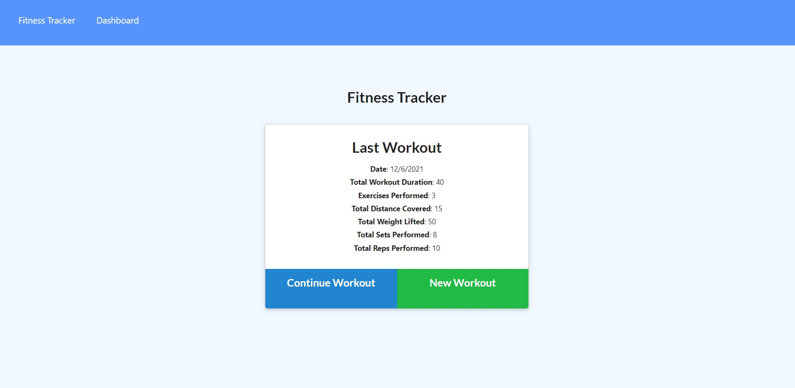

# Workout Tracker
Created by Shawn Miller

# Table of Contents
* [Description](#Description)
* [Installation](#Installation)
* [Usage](#Usage)
* [Technologies](#Technologies)
* [Appearance](#Appearance)
* [Bugs](#Bugs)
* [Contact-Info](#Contact-Info)

# Description
This app is a workout tracker used to track daily workouts.  A user will be able to log nultiple exercises in a workout on a given day. The user will be able to track the name, type , weight, sets, reps and duration of exercise. If it is a cardio exercise a user will be able to track the distance traveled.

# Installation
A user will only need to following the Heroku link below to run it through the web.  If a user wants to run it locally they will need to download the code from the repository linked below, install node.js, install npm and they can run the code by typing "npm start" at the command line.

# Usage
This app is deployed to Heroku and can be accessed using the following link:
https://workout-tracker-smm.herokuapp.com/

Use the following link to access the repository:
https://github.com/Shawn52409/Workout-Tracker

# Technologies
- Node.js
- npm dotenv
- npm express
- JavaScript
- mongoose
- mongodb
- mongodb atlas
- Heroku

# Appearance

# Bugs
Currently the app will only save to the database on a local machine. Currently the Heroku deployed app is being debugged to fix the connection between the code, Heroku and the mongodb Atlas database. As soon as that issue is fixed this README will be updated.

# Contact-Info
shawnsmm@gmail.com

github.com/Shawn52409

www.linkedin.com/in/shawn-miller-b44a36217